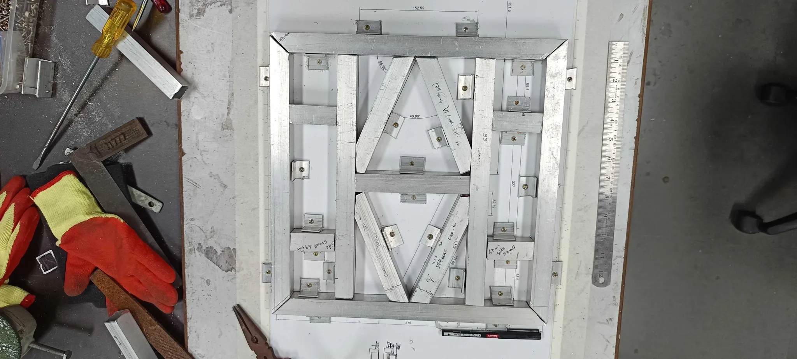
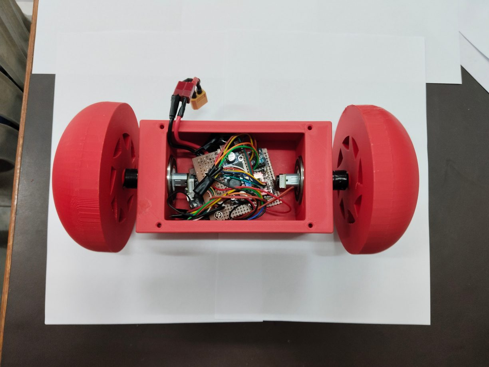
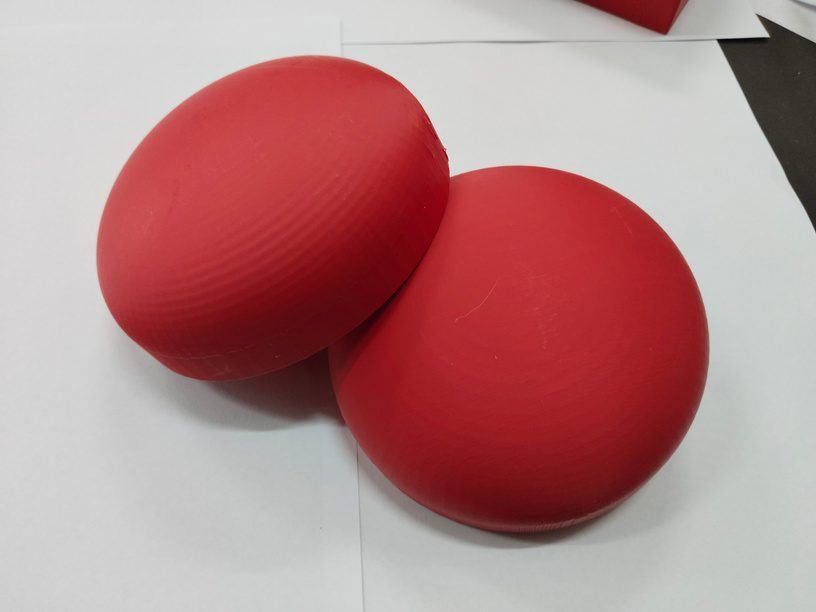
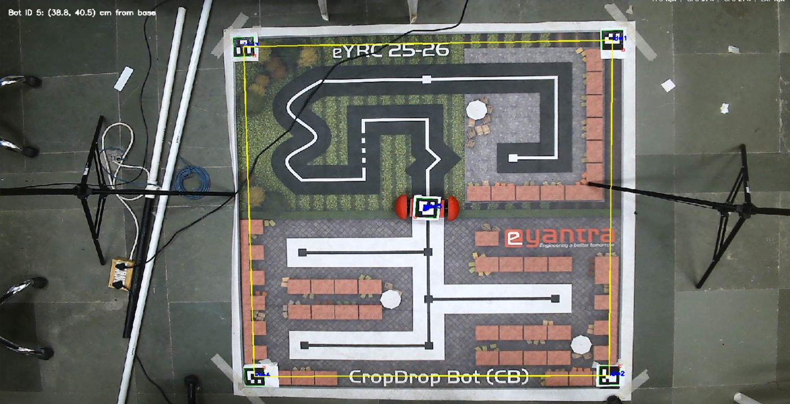

# Projects with Interns
{: .fs-9 }

I have had the chance to mentor some brilliant students from across India at e-Yantra, IIT Bombay. This page features the projects they built under my guidance. The interns did the building; I helped scope the problems, unblock them, and steer the work.
{: .fs-5 .fw-300 .page-lead }

---

  

    <iframe src="https://www.youtube.com/embed/7njQa0MK4l0" title="eIPL - Students Field Experience" loading="lazy" allow="accelerometer; autoplay; clipboard-write; encrypted-media; gyroscope; picture-in-picture; web-share" referrerpolicy="strict-origin-when-cross-origin" allowfullscreen></iframe>
  

  

    Initiative I led · 2025
    <h3>eIPL: Field Immersion at Vigyan Ashram</h3>
    Field ResearchAgricultureProblem Discovery
    
Together with a team of two colleagues, I led the e-Yantra Innovation Premiere League (eIPL) field experience. We took eight teams of my interns from across India to Vigyan Ashram, Pabal, for five days in a rural setting. The students visited farms, spoke with farmers, validated real problem statements on the ground, and ideated practical solutions. The goal was for them to learn that meaningful innovation starts in the field, with empathy for the people it serves, and not online.

  

## eYSIP 2026
{: .mt-8 }

Projects from the e-Yantra Summer Internship Program, May – July 2026.
{: .fw-300 }

  

    <iframe src="https://www.youtube.com/embed/JWiUAAIUkGI" title="Autonomous Navigation & on-field Scheduled Task Execution on 4 Wheel Differential Drive Robot" loading="lazy" allow="accelerometer; autoplay; clipboard-write; encrypted-media; gyroscope; picture-in-picture; web-share" referrerpolicy="strict-origin-when-cross-origin" allowfullscreen></iframe>
  

  

    <h3>Autonomous Navigation &amp; Scheduled Task Execution on a 4-Wheel Differential Drive Robot</h3>
    ROS 2LiDAR + IMUOutdoor Navigation
    
An autonomy framework that lets a differential-drive robot carry out scheduled, site-specific tasks across the IIT Bombay campus. It combines LiDAR and IMU sensor fusion for localization outdoors, a priority-based task scheduler connected to the navigation stack, and global and local planning that avoids pedestrians and other moving obstacles.

    

      <strong>Interns:</strong> Madhav Bangad, Tarusi M, Smaran Rajagopal 
      <strong>Co-mentor:</strong> Jaison Jose
    

  

  

    
    
    
  

  

    <h3>Research &amp; Development on Robotic Drives</h3>
    Mechanical DesignESP32ROS 2 · Nav2
    
A modular 4-wheel skid-steer mobile base that runs on just two motors and is designed for a 20 kg payload. Its universal mounting plate lets different lab setups be mounted and swapped easily, so one base can serve several problem statements. The interns built a custom jig to weld the aluminium chassis accurately, then built the ESP32 control electronics (Cytron MDDS20A driver, encoder and IMU feedback). They also wrote the robot's URDF and brought up SLAM and Nav2 on it.

    

      <strong>Interns:</strong> Sushant Koul, Krish Gandhi, Aranis Sinha 
      <strong>Co-mentor:</strong> Bhavik Jain
    

  

  

    <iframe src="https://www.youtube.com/embed/kYaNRIz7E64" title="Exploring Arduino UNO Q Based SOC for IOT based Automation" loading="lazy" allow="accelerometer; autoplay; clipboard-write; encrypted-media; gyroscope; picture-in-picture; web-share" referrerpolicy="strict-origin-when-cross-origin" allowfullscreen></iframe>
  

  

    <h3>Arduino UNO Q based IoT Automation for Lab Power Management</h3>
    IoTPCB DesignPower Electronics
    
An evaluation of the Arduino UNO Q as the controller for a centralized lab power-management system. Through a network portal, users can switch high-power lab equipment in real time. The switching goes through custom relay power-node boards with opto-isolated relay drivers, and fail-safe logic plus transient suppression protect the hardware when switching inductive loads.

    

      <strong>Interns:</strong> Sahil Pandhare, Richu Mathew Shaji
    

  

  

    
    
    
  

  

    <h3>Kinetic-Resilient Autonomous Props (KRAP)</h3>
    ESP32Sensor FusionOpenCV · ArUco
    
In a pick-and-place setup, a prop that falls out of the robot arm's reach normally needs a person to reset it. KRAP turns the prop itself into a small two-wheeled robot that rights itself and drives back to its reset position. Its rounded, low-centre-of-gravity shell lets it self-right using only motor torque. An MPU6050 IMU detects when it has fallen, encoders give odometry, arena-mounted ArUco markers provide global localization, and live telemetry and OTA updates run over a Wi-Fi WebSocket link.

    

      <strong>Interns:</strong> Tanush Karkhanis, Sidharth R 
      <strong>Co-mentor:</strong> Bhavik Jain
    

  

  

    <iframe src="https://www.youtube.com/embed/ZjkBd9-yyqU" title="Digitization of 3D Printing for Utilization Tracking and Process Monitoring" loading="lazy" allow="accelerometer; autoplay; clipboard-write; encrypted-media; gyroscope; picture-in-picture; web-share" referrerpolicy="strict-origin-when-cross-origin" allowfullscreen></iframe>
  

  

    <h3>Digitization of 3D Printing</h3>
    Embedded SystemsAdditive ManufacturingMonitoring
    
Adding utilization tracking and process monitoring to 3D printers, so that a lab can see how its printers are being used and keep an eye on prints while they run.

    

      <strong>Intern:</strong> Aditya Kumar
    

  

## eYSIP 2025
{: .mt-8 }

Projects from the e-Yantra Summer Internship Program, May – July 2025.
{: .fw-300 }

  

    <iframe src="https://www.youtube.com/embed/KVSUH5FEqVQ" title="Camera Based Localization and Mechanism Design for coBot Interaction (eBot)" loading="lazy" allow="accelerometer; autoplay; clipboard-write; encrypted-media; gyroscope; picture-in-picture; web-share" referrerpolicy="strict-origin-when-cross-origin" allowfullscreen></iframe>
  

  

    <h3>Camera-Based Localization for a 4-Wheel Differential Drive Robot (eBot)</h3>
    Computer VisionOpenCV · ArUcoROS 2
    
This project localizes a warehouse robot using two overhead CCTV cameras instead of sensors on the robot. The interns calibrated the cameras and aligned both views to a common floor frame using ArUco-marker triangulation and homographies. From the camera feeds they generated a ROS 2 occupancy map and tracked the robot's pose in real time. A boundary monitor also detects breaks in the arena's yellow tape and publishes them as virtual laser scans, so the navigation stack treats them as obstacles.

    

      <strong>Interns:</strong> Shubham Sarkar, Anshul Choudhary
    

  

  

    <iframe src="https://www.youtube.com/embed/NBoTubueuMk" title="eYSIP25 - Hardware Automation of eBot" loading="lazy" allow="accelerometer; autoplay; clipboard-write; encrypted-media; gyroscope; picture-in-picture; web-share" referrerpolicy="strict-origin-when-cross-origin" allowfullscreen></iframe>
  

  

    <h3>Hardware Automation for a 4-Wheeled Robot (eBot)</h3>
    ROS 2LiDAR · Machine LearningAuto-Docking
    
This project gave the eBot autonomous navigation and the ability to find its dock and charge itself. For navigation, the intern built a custom map server, a Dijkstra path planner and a PD waypoint follower, connected through a ROS 2 action server with a fast abort command. For docking, a custom split-and-merge line extractor turns 2D LiDAR scans into geometric features, and a Random Forest classifier uses them to recognise the charging station. The project also included a React web app for monitoring and controlling the robot.

    

      <strong>Intern:</strong> Sahil Shinde 
      <strong>Co-mentor:</strong> Gauresh Wadekar
    

  

  

    <iframe src="https://www.youtube.com/embed/RAIaRzOPs_c" title="eYSIP Project 6: R&D for Agriculture & Mobile Sense" loading="lazy" allow="accelerometer; autoplay; clipboard-write; encrypted-media; gyroscope; picture-in-picture; web-share" referrerpolicy="strict-origin-when-cross-origin" allowfullscreen></iframe>
  

  

    <h3>R&amp;D for Agriculture &amp; MobileSense</h3>
    AgricultureSensingIoT
    
Agricultural research and development built around <a href="Projects/MobileSense.html">MobileSense</a>, my portable micro-climate sensing device. It plugs into a phone over USB-C and logs temperature, humidity and pressure while a farmer walks the field.

  

