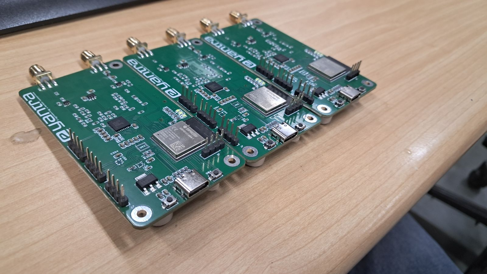
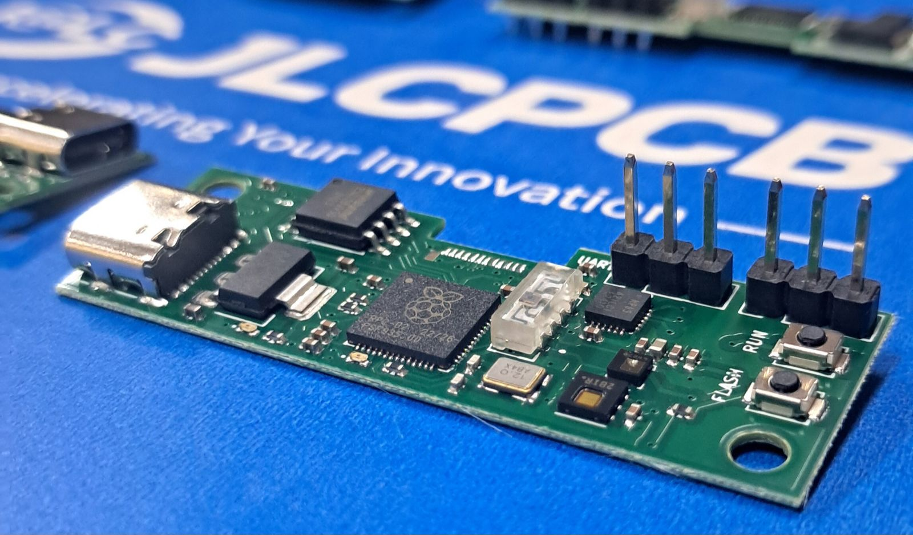
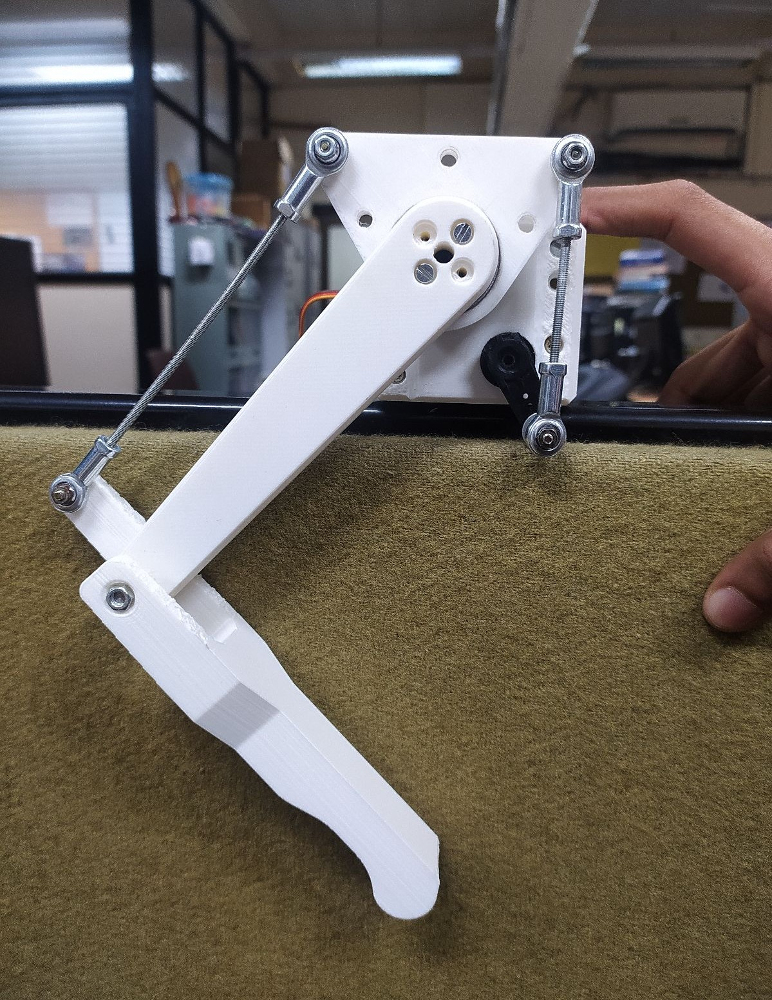
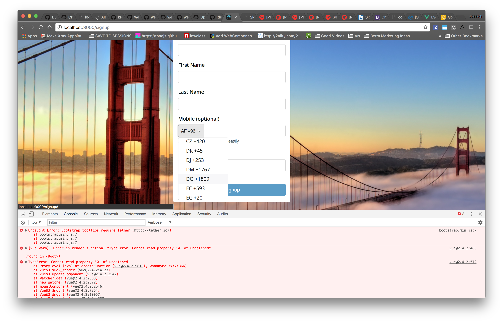

<!-- This is a *bare-minimum* template to create a Jekyll site that uses the [Just the Docs] theme. You can easily set the created site to be published on [GitHub Pages] – the [README] file explains how to do that, along with other details. -->

<!-- Test{: .label .label-yellow } -->
<!-- 
Deprecated
{: .label .label-red }
April 2024
{: .label .label-yellow } -->

| Agri-Edge | MobileSense |
|:-------------:|:------------------:|
|   The device is a mobile SDR tool that can function as a data interpreter and a weather station. Supports data access from 150+ weather stations and features connectivity options for LoRa 433/868, Wi-Fi, BLE and GSM 4G |   A USB-C compatible device with sensors for lux, temperature, humidity, pressure, and IMU, designed for Microclimate analysis.
[Read More](/docs/Projects/AgriEdge.html){: .btn .btn-green .fs-4 .mb-2 .mb-md-0 .mr-2 } | [Read More](/docs/Projects/MobileSense.html){: .btn .btn-green .fs-4 .mb-2 .mb-md-0 .mr-2 } | 

| Research on Remote Labs for Robotics Education | Human Wildlife Conflict- Fab 2023 Bhutan |
|:-------------:|:------------------:|
|  Low-cost remote lab platform to make industrial robotics education more accessible. We tested the platform with 1,000+ students during the lab’s e-Yantra Robotics Competition.|   At Fab 23 Conference in Bhutan I was deployed in Limbhukha village, we worked on developing sustainable solutions for wildlife interference on farms. 
[Read More](/docs/Projects/CL.html){: .btn .btn-green .fs-4 .mb-2 .mb-md-0 .mr-2 } | [Read More](/docs/Projects/Fab23.html){: .btn .btn-green .fs-4 .mb-2 .mb-md-0 .mr-2 } | 

| Automotive Grade Dead Reconking for Telematic Devices | Oxygen Concentrator Monitoring System |
|:-------------:|:------------------:|
|   Developed an low cost 3 Dimensional Dead Reckoning System, that will assist the gps and provide navigational support in absence of GPS signal or when the signal is weak. We used the IMU of GY5-21, ADXL-345 etc. for the Implementation. |  A system to monitor power parameters, oxygen purity, and air flow rate etc. Aim was to enhance ambulance oxygen storage for critically ill patients during prolonged transport.
[Read More](/docs/Projects/DeadReconking.html){: .btn .btn-green .fs-4 .mb-2 .mb-md-0 .mr-2 } | [Read More](/docs/Projects/Concentrator.html){: .btn .btn-green .fs-4 .mb-2 .mb-md-0 .mr-2 } | 

| Multi-Agent Heirarchial Architecture for Quadraped Robot | Fab-able Low Cost Drones & Custom FlightController Firmware |
|:-------------:|:------------------:|
|   I am working in a team of 2, of developing a quadruped robot, the twist is each leg is an individual agent with no central coordinator. |  I developed a ~1000Rs drone that can be made using generic fab lab equipments and components. It is arduino compatible, with a custom firmware implementing EKF.
<!-- [Read More](#link_0){: .btn .btn-green .fs-4 .mb-2 .mb-md-0 .mr-2 } | [Read More](#link_0){: .btn .btn-green .fs-4 .mb-2 .mb-md-0 .mr-2 } |  -->

| Robot Path Rectification & Odometry of 3 & 4 Wheel Holonomic Drive | Low Cost Wireless HID Device Development & Analysis |
|:-------------:|:------------------:|
|   I did the kinematical modeling and firmware for PID based Odometry and path rectifcation.  |   I researched wireless HID devices in the robotics lab, benchmarking various wireless technologies for low-latency, high-data-rate communication. Targeting 2 Mbps with minimal computational overhead.
<!-- [Read More](#link_0){: .btn .btn-green .fs-4 .mb-2 .mb-md-0 .mr-2 } | [Read More](#link_0){: .btn .btn-green .fs-4 .mb-2 .mb-md-0 .mr-2 } |  -->

| [Open Source] Interfacing Proprietary HID Devices via Native USB on Teensy 4.1 | Android Application for Image Processing and Object Detection |
|:-------------:|:------------------:|
|   Developed a library for interfacing controllers like Xbox, Playstation etc. to work with ARM based controllers (Teeny 4.1)  |  Developed android application for deploying custom object detection models. Supports wireless communication for robot integration.
<!-- [Read More](#link_0){: .btn .btn-green .fs-4 .mb-2 .mb-md-0 .mr-2 } | [Read More](#link_0){: .btn .btn-green .fs-4 .mb-2 .mb-md-0 .mr-2 } |  -->

| Real Time Custom Object Detection using Open CV and Raspi 4B | Algorithm for Robot path rectification using IMU |
|:-------------:|:------------------:|
|   Developed an low cost 3 Dimensional Dead Reckoning System, that will assist the gps and provide navigational support in absence of GPS signal or when the signal is weak. We used the IMU of GY5-21, ADXL-345 etc. for the Implementation. |  Developed an low cost 3 Dimensional Dead Reckoning System, that will assist the gps and provide navigational support in absence of GPS signal or when the signal is weak. We used the IMU of GY5-21, ADXL-345 etc. for the Implementation.
<!-- [Read More](#link_0){: .btn .btn-green .fs-4 .mb-2 .mb-md-0 .mr-2 } | [Read More](#link_0){: .btn .btn-green .fs-4 .mb-2 .mb-md-0 .mr-2 } |  -->

| Object Detection using IMU | Electronic Attendance Module |
|:-------------:|:------------------:|
|  Developed firmware for custom object detection using inertial Measurement Units. The concept was to detect ferromagnetic objects based on deviations in the magnetic field to detect the type of automotive in the vicinity. |  Developed an attendance module deployed in my college. It has cloud support and integrated into an procotored examination system.
<!-- [Read More](#link_0){: .btn .btn-green .fs-4 .mb-2 .mb-md-0 .mr-2 } | [Read More](#link_0){: .btn .btn-green .fs-4 .mb-2 .mb-md-0 .mr-2 } |  -->

| Speedometer Odometer & Telemetry for E-Bike | Regional Power Generation Predictor |
|:-------------:|:------------------:|
|   Developed a display and telemetry system for an custom eBike. It used GLCD as output. |  Developed a power generation predictor for wind mills and turbines. It also gives reccomendations for acheiving optimum power output.
<!-- [Read More](#link_0){: .btn .btn-green .fs-4 .mb-2 .mb-md-0 .mr-2 } | [Read More](#link_0){: .btn .btn-green .fs-4 .mb-2 .mb-md-0 .mr-2 } |  -->

<!-- | Proctored Examination Software | Project Management System Software |
|:-------------:|:------------------:|
|   [Read More](#link_0){: .btn .btn-green .fs-4 .mb-2 .mb-md-0 .mr-2 }           |   [Read More](#link_0){: .btn .btn-green .fs-4 .mb-2 .mb-md-0 .mr-2 } |  -->

<!-- | Weather Predictor ML | Sudoku Solver AI |
|:-------------:|:------------------:|
|   [Read More](#link_0){: .btn .btn-green .fs-4 .mb-2 .mb-md-0 .mr-2 }           |   [Read More](#link_0){: .btn .btn-green .fs-4 .mb-2 .mb-md-0 .mr-2 } |  -->

<!-- | Dustbin for Dry Garbage | Water Wastage Controller |
|:-------------:|:------------------:|
|   [Read More](#link_0){: .btn .btn-green .fs-4 .mb-2 .mb-md-0 .mr-2 }           |   [Read More](#link_0){: .btn .btn-green .fs-4 .mb-2 .mb-md-0 .mr-2 } |  -->

----