# Projects
{: .fs-9 }

Things I have designed and built, from autonomous robots and custom PCBs to field devices for agriculture. Cards marked "Read more" have a full write-up.
{: .fs-5 .fw-300 .page-lead }

  View
  <button type="button" data-view="mixed" aria-pressed="true">All projects</button>
  <button type="button" data-view="category" aria-pressed="false">By category</button>

  

    
    

      Robotics &amp; Autonomy
      <h4>F1TENTH Autonomous Race Car</h4>
      
ROS 2Controls

      
A 1/10-scale autonomous race car with IMU-fused odometry, an offline minimum-curvature raceline optimizer, and Stanley + VFH, MPPI and MPC racing controllers.

      <a class="read-more" href="Projects/F1Tenth.html">Read more →</a>
    

  

  

    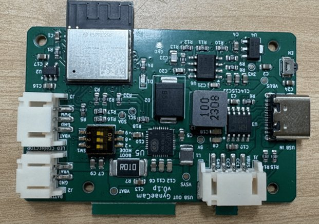
    

      Electronics &amp; Embedded
      <h4>GynaeCam: Control &amp; Lighting Electronics</h4>
      
PCB DesignESP32-C3

      
Battery-powered control and LED lighting electronics for a portable camera device: USB-C Power Delivery, Li-ion charging with a fuel gauge, and a PWM-dimmed high-power LED driver on a 4-layer board.

      <a class="read-more" href="Projects/GynaeCam.html">Read more →</a>
    

  

  

    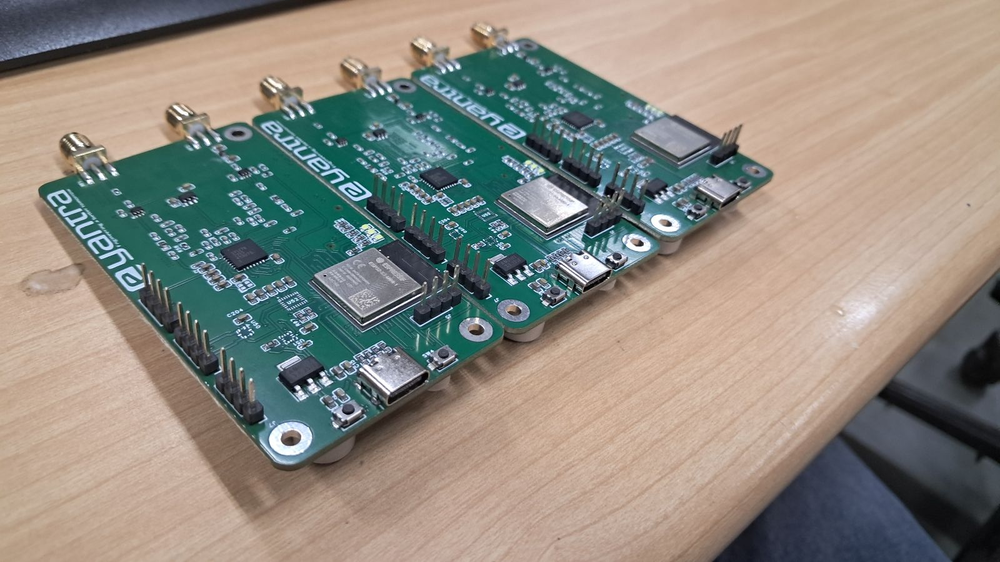
    

      Agriculture &amp; Environment
      <h4>Agri-Edge</h4>
      
SDRLoRa · GSM

      
A mobile SDR tool that works as a data interpreter and a weather station. It can read data from 150+ weather stations and connects over LoRa 433/868, Wi-Fi, BLE and 4G.

      <a class="read-more" href="Projects/AgriEdge.html">Read more →</a>
    

  

  

    
    

      Robotics &amp; Autonomy
      <h4>Automated Tomato Sorting Machine</h4>
      
Machine VisionESP32

      
Grades tomatoes as ripe, unripe or overripe using a Keras model with multi-view capture, twisting verified by optical flow, and ESP32-driven feed and drop mechanisms.

      <a class="read-more" href="Projects/TomatoSorter.html">Read more →</a>
    

  

  

    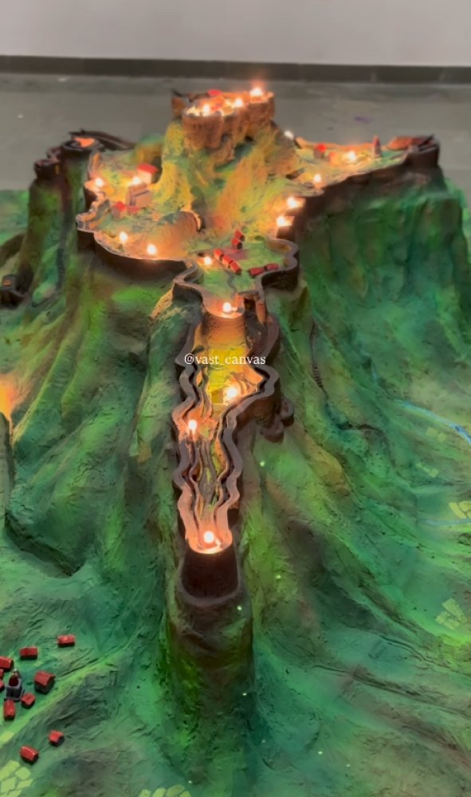
    

      Electronics &amp; Embedded
      <h4>Illuminated Scale Models of Historical Forts</h4>
      
EducationLighting Control

      
Scale replicas of historical forts with built-in lighting, made as an educational exhibit and now installed at a school. I did the electronics and programming.

      <a class="read-more" href="Projects/Forts.html">Read more →</a>
    

  

  

    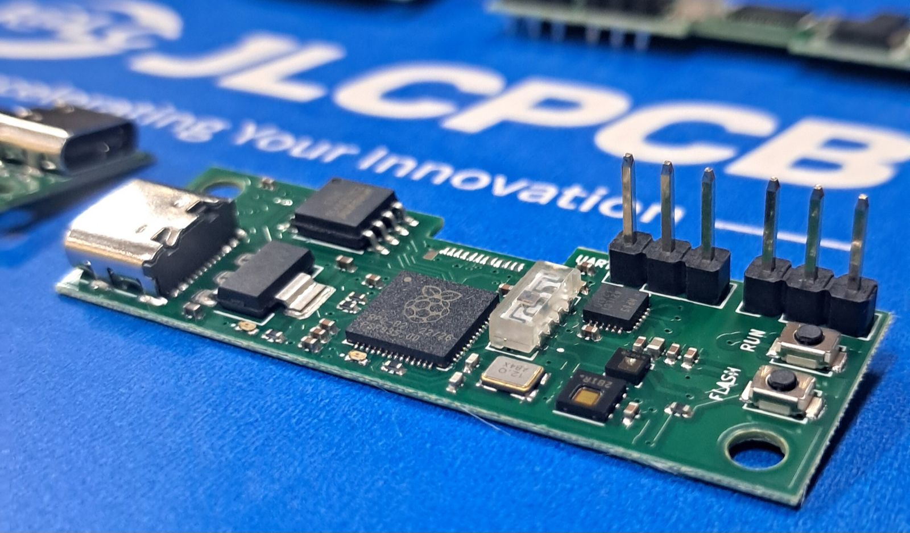
    

      Agriculture &amp; Environment
      <h4>MobileSense</h4>
      
SensingUSB-C

      
A USB-C micro-climate sensing device with sensors for light, temperature, humidity, pressure and motion.

      <a class="read-more" href="Projects/MobileSense.html">Read more →</a>
    

  

  

    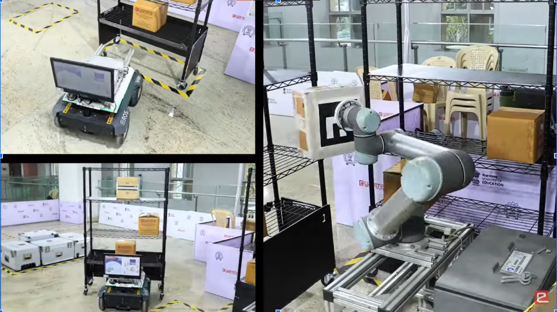
    

      Robotics &amp; Autonomy
      <h4>Remote Labs for Robotics Education</h4>
      
ResearchIndustrial Robotics

      
A low-cost remote lab platform that makes industrial robotics education more accessible, tested with 1,000+ students in the e-Yantra Robotics Competition.

      <a class="read-more" href="Projects/CL.html">Read more →</a>
    

  

  

    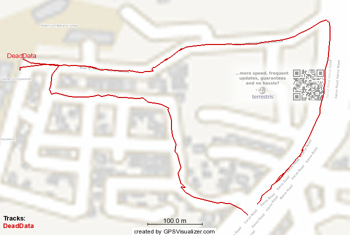
    

      Electronics &amp; Embedded
      <h4>Automotive-Grade Dead Reckoning for Telematics</h4>
      
Sensor FusionIMU

      
A low-cost 3D dead reckoning system that supports GPS navigation, and takes over when the signal is weak or lost.

      <a class="read-more" href="Projects/DeadReconking.html">Read more →</a>
    

  

  

    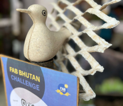
    

      Agriculture &amp; Environment
      <h4>Human-Wildlife Conflict: Fab 23 Bhutan</h4>
      
Field Work

      
At the Fab 23 conference in Bhutan, I was deployed in Limbhukha village to develop sustainable solutions to wildlife damaging farms.

      <a class="read-more" href="Projects/Fab23.html">Read more →</a>
    

  

  

    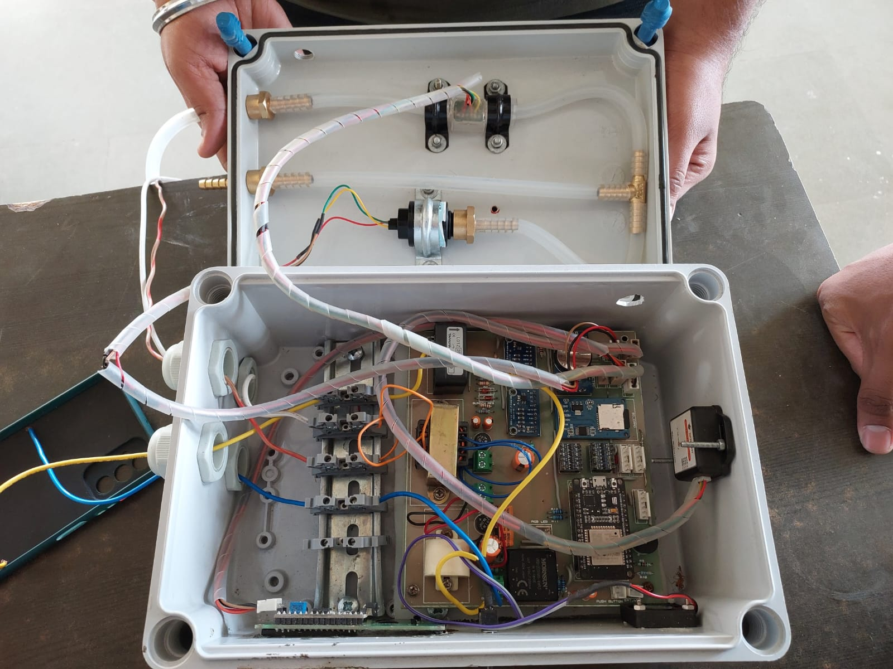
    

      Electronics &amp; Embedded
      <h4>Oxygen Concentrator Monitoring System</h4>
      
MedicalMonitoring

      
Monitors power parameters, oxygen purity and air flow rate, to improve oxygen supply for critically ill patients during long ambulance transfers.

      <a class="read-more" href="Projects/Concentrator.html">Read more →</a>
    

  

  

    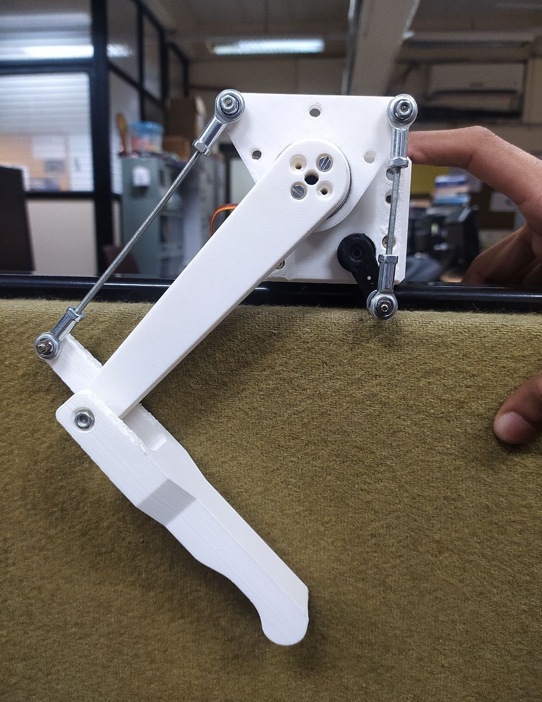
    

      Robotics &amp; Autonomy
      <h4>Multi-Agent Architecture for a Quadruped</h4>
      
Legged Robotics

      
A quadruped robot built in a team of two. The twist: each leg is an independent agent, with no central coordinator.

    

  

  

    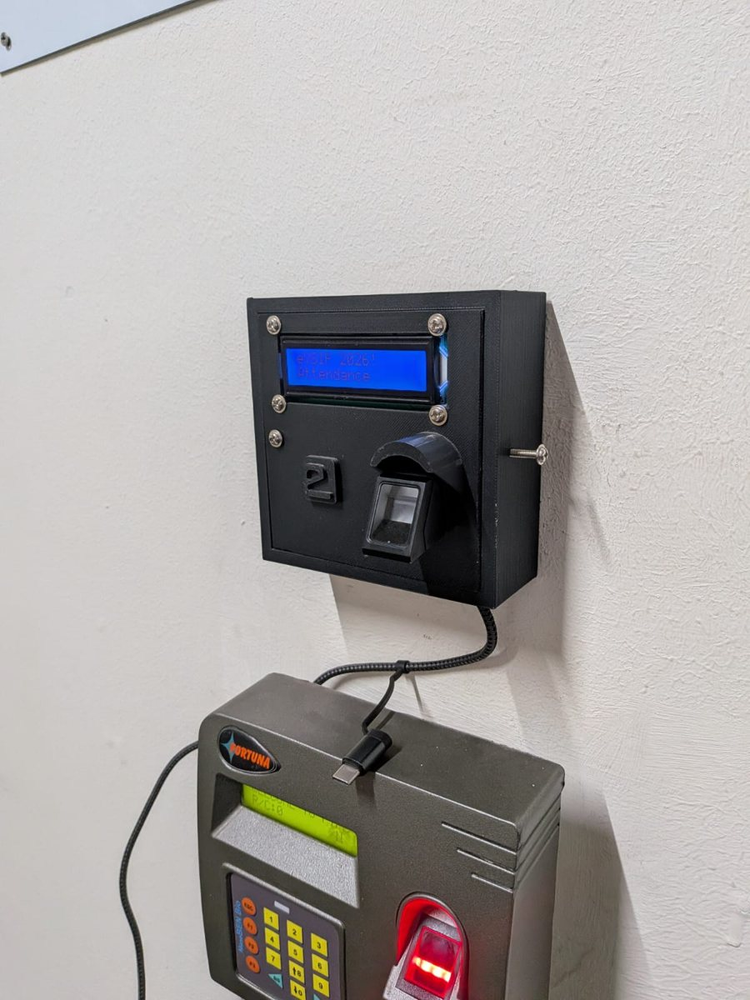
    

      Electronics &amp; Embedded
      <h4>Open-Source Biometric Attendance Module</h4>
      
Open SourceESP32Google Sheets

      
A free, database-free fingerprint attendance system: an ESP32 device that uses a Google Sheet as its backend, with no server, hosting or bills.

      <a class="read-more" href="Projects/Attendance.html">Read more →</a>
    

  

  

    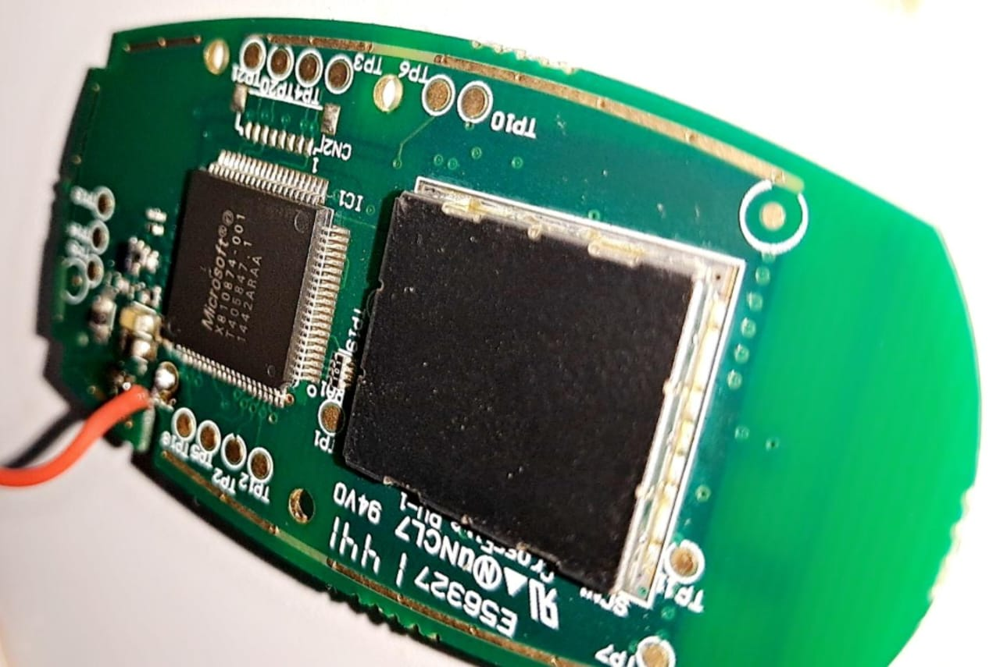
    

      Electronics &amp; Embedded
      <h4>Proprietary HID Devices over Native USB on Teensy 4.1</h4>
      
Open SourceUSB

      
A library for connecting controllers such as Xbox and PlayStation pads to ARM-based microcontrollers (Teensy 4.1).

    

  

  

    
    

      Robotics &amp; Autonomy
      <h4>Fab-able Low-Cost Drone &amp; Flight Controller</h4>
      
AerialFirmware

      
A ~₹1000 drone that can be made with generic fab lab equipment and components. It is Arduino-compatible, with custom flight controller firmware that implements an EKF.

    

  

  

    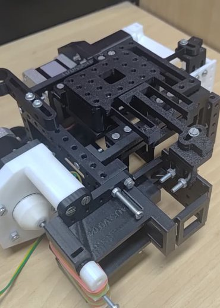
    

      Electronics &amp; Embedded
      <h4>RepRapMicron Replica</h4>
      
Open SourceMotion Control

      
A replica of the open-source <a href="https://github.com/VikOlliver/RepRapMicron">RepRapMicron</a>, a 3D printer for micron-scale fabrication. I also wrote joystick programs to control the tool head.

    

  

  

    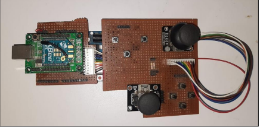
    

      Electronics &amp; Embedded
      <h4>Low-Cost Wireless HID Devices</h4>
      
Wireless

      
Benchmarking wireless technologies for low-latency, high-data-rate robot controllers, targeting 2 Mbps with minimal computational overhead.

    

  

  

    
    

      Robotics &amp; Autonomy
      <h4>Odometry &amp; Path Rectification for Holonomic Drives</h4>
      
KinematicsFirmware

      
Kinematic modelling and firmware for 3 and 4-wheel holonomic drives: PID-based odometry, plus an IMU-based algorithm that rectifies the robot's path.

    

  

  

    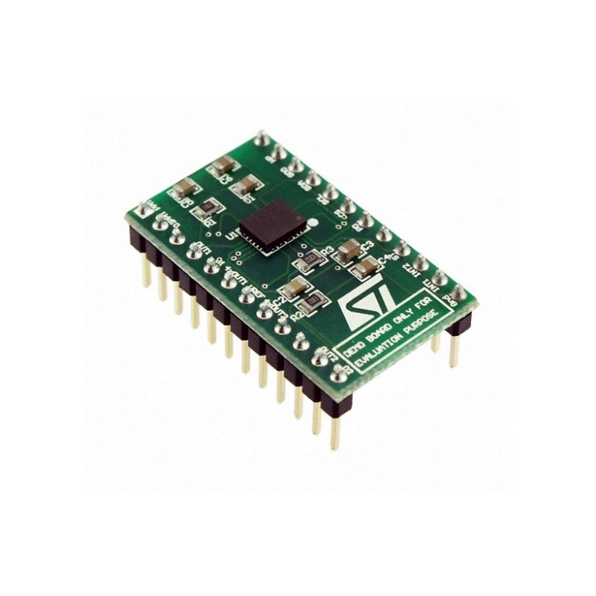
    

      Electronics &amp; Embedded
      <h4>Object Detection using an IMU</h4>
      
FirmwareMagnetometer

      
Detects ferromagnetic objects from deviations in the magnetic field, to identify the type of vehicle nearby.

    

  

  

    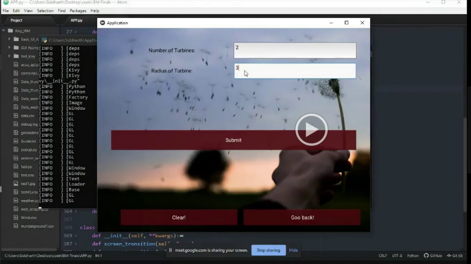
    

      Agriculture &amp; Environment
      <h4>Regional Power Generation Predictor</h4>
      
Prediction

      
Predicts power generation for wind turbines and gives recommendations for getting the best output.

    

  

  

    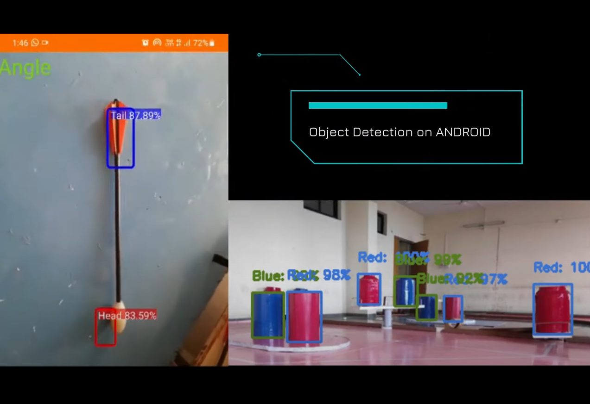
    

      Robotics &amp; Autonomy
      <h4>Real-Time Object Detection on a Raspberry Pi 4B</h4>
      
Computer Vision

      
Custom object detection running in real time on a Raspberry Pi 4B with OpenCV.

    

  

  

    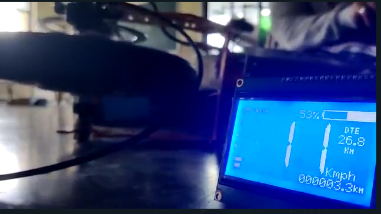
    

      Electronics &amp; Embedded
      <h4>Speedometer, Odometer &amp; Telemetry for an E-Bike</h4>
      
Embedded

      
A GLCD display and telemetry system for a custom e-bike.

    

  

  

    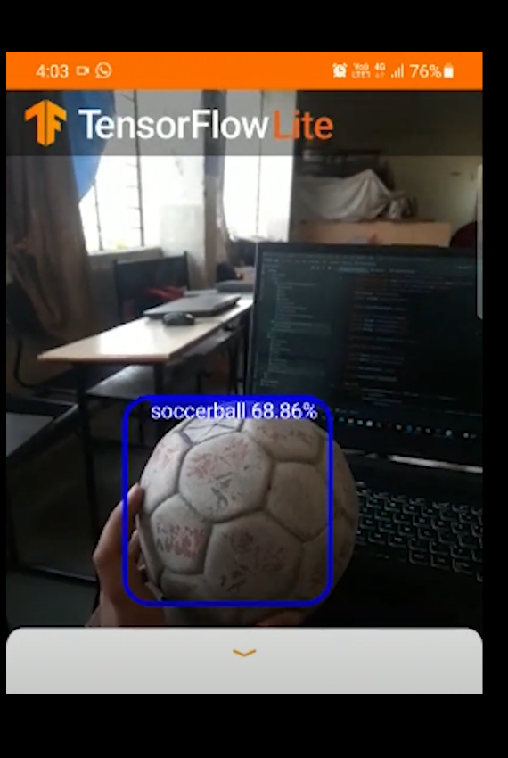
    

      Robotics &amp; Autonomy
      <h4>Android App for Object Detection</h4>
      
Computer VisionAndroid

      
An Android app for deploying custom object detection models, with wireless communication for integrating with robots.

    

  

## More Work
{: .mt-8 }

Other projects I have worked on, without write-ups yet.
{: .fw-300 }

  
<strong>Outcome-Driven Control for CNC Machines</strong>
Personal

  
<strong>grbl-HAL for High-Speed Laser Engraving</strong>Optimizing grbl-HAL on a Teensy 4.1 for high-speed laser engraving.
Personal

  
<strong>4-Wheel Differential Drive Platform</strong>A robotic platform for education and small-scale automation.
ERTS Lab, IIT Bombay

  
<strong>Open-Source Universal Climate Data Acquisition</strong>An open-source system for collecting climate data.
ERTS Lab, IIT Bombay

  
<strong>Pest Detection &amp; Prediction</strong>For capsicum and custard apple crops.
ERTS Lab, IIT Bombay

  
<strong>Polyhouse Cultivation &amp; Pest Growth Study</strong>How different cultivation approaches in polyhouses affect pest growth.
ERTS Lab, IIT Bombay

  
<strong>Efficient Onion Storage System</strong>
ERTS Lab, IIT Bombay

