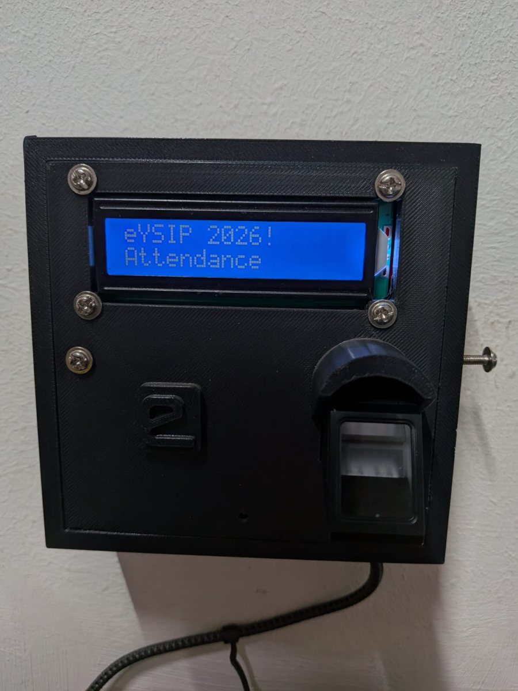
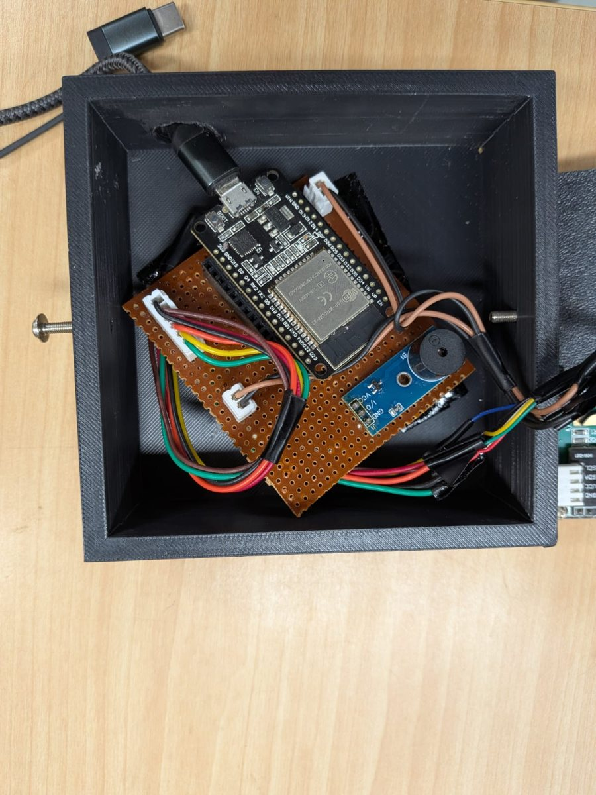
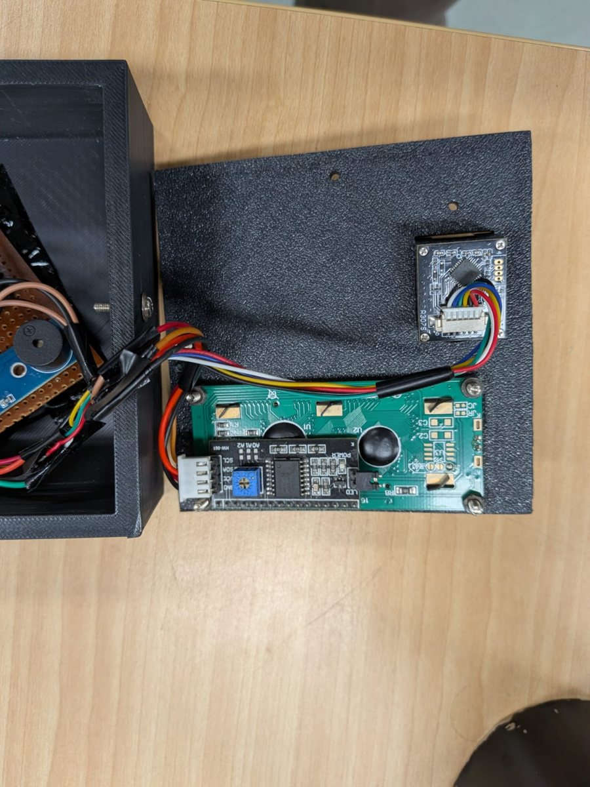

<!-- ---
layout: default
title: Home
# nav_enabled: false
--- -->
#  Open-Source Biometric Attendance Module
{: .fs-9 }

  <figure>
    
    <figcaption>The device, showing its LCD and fingerprint sensor</figcaption>
  </figure>
  <figure>
    
    <figcaption>Deployed for eYSIP 2026</figcaption>
  </figure>

## Overview
A free, **database-free** attendance system. An ESP32 with a fingerprint sensor uses a **Google Sheet as its backend**: the sheet holds the student list, and every scan is written back to it through a Google Apps Script web app. Students check their attendance on a published sheet. There is no server, no hosting and no bills.

The module was deployed to take attendance for the e-Yantra Summer Internship Program (eYSIP) 2026.

[GitHub Repository](https://github.com/Siddharth2308/esp32-attendance-module){: .btn .btn-green .fs-4 .mb-2 .mb-md-0 .mr-2 }

## How It Works
1. **Student list:** the roster lives in a Google Sheet that is published as CSV. The ESP32 downloads it and caches it on its own filesystem.
2. **Scan:** a student touches the trigger and places an enrolled finger on the sensor. The LCD and buzzer confirm the scan.
3. **Log:** the device calls the Apps Script web app with the student's ID, name, project and room. The script logs the scan and marks the student present in the attendance tab.
4. **View:** students see their attendance on the published sheet, and a daily script marks absentees automatically.

Every scan is also buffered locally on the device.

## Salient Features
- **No Backend to Run:**
  - Google Sheets and Apps Script do the job of the database and server, so the system costs nothing to operate.
- **On-Device Web Interface:**
  - The ESP32 serves a local web page for enrolling fingerprints, viewing students and downloading the cached data. Endpoints cover enrolling, syncing the student list and deleting fingerprints.
- **Simple Configuration:**
  - Every setting lives in one file: Wi-Fi credentials, the two sheet URLs, time zone and pins. The firmware itself does not need to be edited.
- **Accurate Timestamps:**
  - The device syncs its time over NTP, with a configurable UTC offset.
- **Custom Enclosure:**
  - A 3D-printed enclosure holds a 16×2 I²C LCD, a capacitive fingerprint sensor, a buzzer, and an ESP32 dev board on perfboard.
- **Open Source:**
  - The firmware (PlatformIO), Apps Script backend and sheet templates are all public, with a step-by-step setup guide.

  <figure>
    
    <figcaption>ESP32 and buzzer on perfboard</figcaption>
  </figure>
  <figure>
    
    <figcaption>LCD and fingerprint sensor mounted in the lid</figcaption>
  </figure>

## Earlier Version
The project grew out of an earlier attendance module I built and deployed at my college, which had cloud support and was integrated into a proctored examination system.
