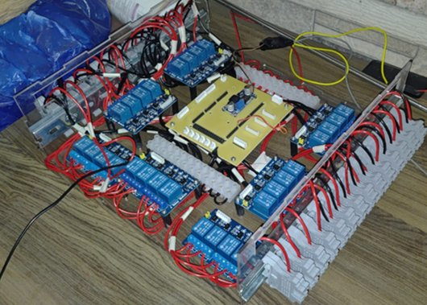

<!-- ---
layout: default
title: Home
# nav_enabled: false
--- -->
#  Illuminated Scale Models of Historical Forts
{: .fs-9 }

  <blockquote class="instagram-media" data-instgrm-permalink="https://www.instagram.com/reel/DJWLR-DzWWU/" data-instgrm-version="14">
    <a href="https://www.instagram.com/reel/DJWLR-DzWWU/" target="_blank" rel="noopener">View this reel by Vast Canvas on Instagram</a>
  </blockquote>

## Overview
These are scale replicas of historical forts of the Sahyadris, built as an educational exhibit so that students can see the different types of fortifications and structures a fort is made of. The model's terrain, walls and buildings are recreated to scale, with lighting built into the fort's structures. The installation is currently on display at a school.

The project was a collaboration with the artists at [Vast Canvas](https://www.instagram.com/vast_canvas/). I handled the electronics and the programming.

  <figure>
    
    <figcaption>The finished fort model, lit up</figcaption>
  </figure>
  <figure>
    
    <figcaption>The electronics control box</figcaption>
  </figure>

## Electronics
- **Central Control Box:**
  - All of the model's lighting is wired back to one enclosure, which holds a custom controller board and banks of relay modules.
- **Switched Lighting Circuits:**
  - The relays switch the lighting circuits individually, so different parts of the fort can be lit on their own.
- **Serviceable Wiring:**
  - Every circuit terminates on terminal blocks along the sides of the box, which keeps the installation easy to maintain on site.

## Behind the Build

  <blockquote class="instagram-media" data-instgrm-permalink="https://www.instagram.com/reel/DJ9oST5Tom5/" data-instgrm-version="14">
    <a href="https://www.instagram.com/reel/DJ9oST5Tom5/" target="_blank" rel="noopener">View this reel by Vast Canvas on Instagram</a>
  </blockquote>
  <blockquote class="instagram-media" data-instgrm-permalink="https://www.instagram.com/reel/DI4ScJcN5Z3/" data-instgrm-version="14">
    <a href="https://www.instagram.com/reel/DI4ScJcN5Z3/" target="_blank" rel="noopener">View this reel by Vast Canvas on Instagram</a>
  </blockquote>

