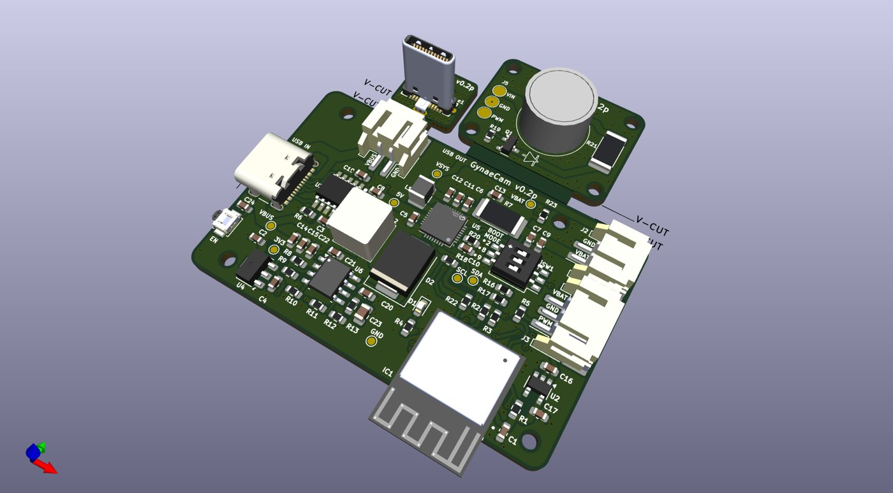
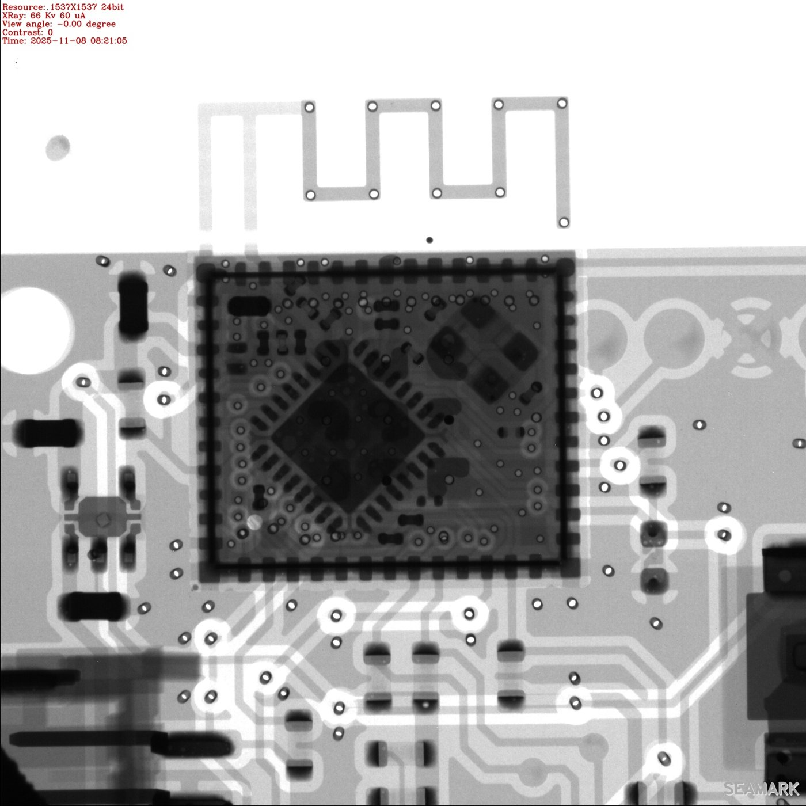

<!-- ---
layout: default
title: Home
# nav_enabled: false
--- -->
#  GynaeCam: Control &amp; Lighting Electronics
{: .fs-9 }

## Overview
I led the electronics design for GynaeCam, a portable, battery-powered camera device developed at IIT Bombay. The system has two boards. The control board handles USB-C power input and negotiation, battery charging and monitoring, and the device's microcontroller. The lighting board carries a high-power LED that illuminates the camera's field of view. Both boards were taken from schematic to assembled prototype over two revisions (v0.1p and v0.2p).

## Salient Features
- **ESP32-C3 Microcontroller:**
  - An ESP32-C3-MINI-1 module with Wi-Fi and BLE, programmed over UART, with a DIP switch to select the boot mode.
- **USB-C Power Delivery:**
  - A CH224K controller negotiates the supply voltage over USB-C PD, and dedicated USB-C in and out ports route power and data.
- **Battery Management:**
  - An AXP2585 handles Li-ion charging and fuel gauging, and reports battery state to the MCU over I²C with an interrupt line.
- **LED Driver:**
  - A TPS54560 switching regulator drives a Cree XLamp XP-L high-power LED. The MCU controls brightness through PWM dimming.
- **Thermal Design:**
  - The LED sits on its own lighting board, with thermal vias under the LED pad to carry heat away.
- **Manufacturing-Ready Layout:**
  - A 4-layer PCB, panelized with V-scored breakout boards (the LED board and a USB-C plug board).
  - Each revision is exported with gerbers, BOM, pick-and-place files and an interactive assembly guide, assembled at JLCPCB, and inspected by X-ray.

  <figure>
    
    <figcaption>v0.2p board panel with its breakout boards (3D render)</figcaption>
  </figure>
  <figure>
    
    <figcaption>X-ray inspection of the assembled v0.1p board</figcaption>
  </figure>

