# Robots
{: .fs-9 }

The robot platforms I have worked with: mobile robots I have made autonomous, robotic arms I have programmed, and the robots I built for ABU Robocon.
{: .fs-5 .fw-300 .page-lead }

---

## Autonomous Mobile Robots

I have implemented autonomous navigation on a wide range of drive configurations, from quadrupeds to skid-steer and holonomic bases, in both indoor and outdoor environments. The work covers localization, mapping, path planning and control across the whole range of stacks: custom navigation stacks written from scratch, fully autonomous execution running entirely on microcontrollers, and Nav2. I have plenty of experience with ROS. That is not the same as liking it.

  3D LiDAR2D LiDARWheel EncodersPassive EncodersIMU

  

    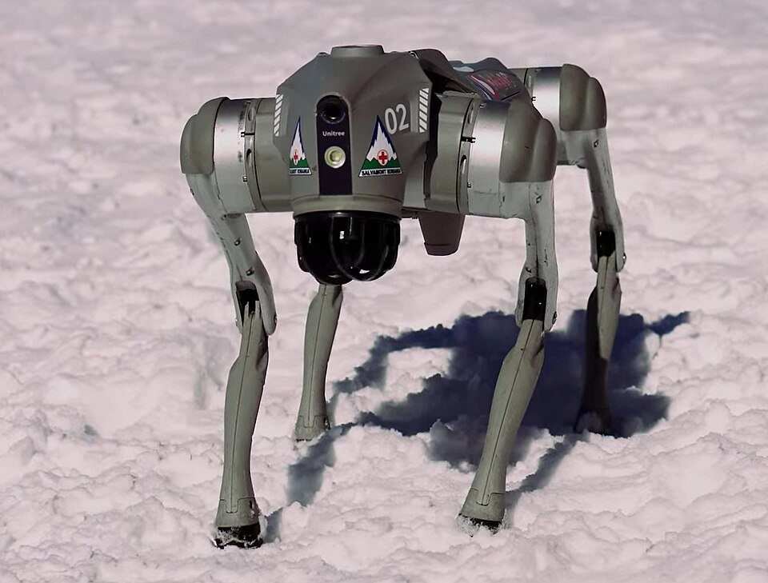
    

      <h4>Unitree Go2</h4>
      
QuadrupedIndoor · Outdoor

      
A legged platform that can handle terrain wheeled robots can't.

    

  

  

    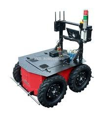
    

      <h4>Outdoor 4WD Skid-Steer</h4>
      
Skid-SteerOutdoor

      
A rugged all-terrain base for navigating unstructured outdoor spaces such as a campus.

    

  

  

    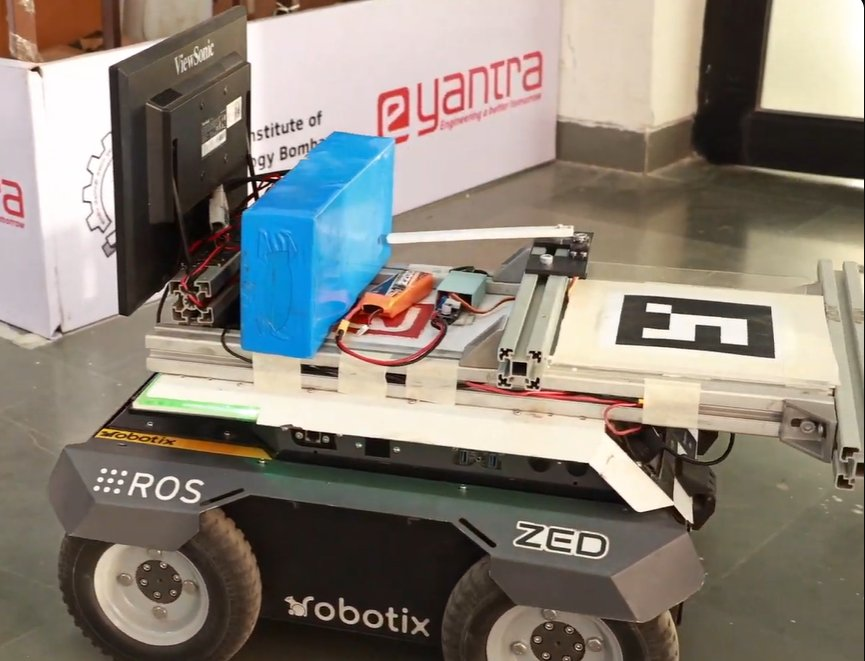
    

      <h4>eBot</h4>
      
4WD DifferentialIndoor

      
A warehouse robot used in e-Yantra's logistics themes, working alongside a robotic arm to move payloads.

    

  

  

    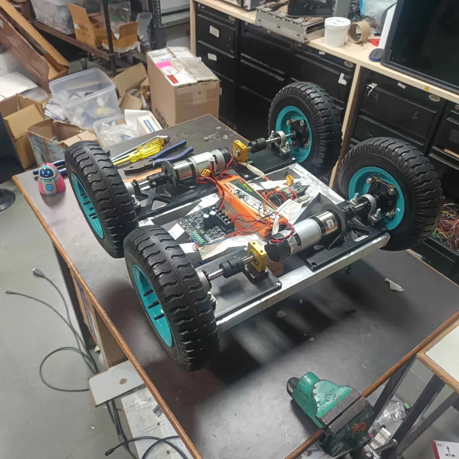
    

      <h4>Modular Skid-Steer Base</h4>
      
Skid-SteerIndoor

      
A custom-built base with a 20 kg payload capacity and a universal mounting plate, running Nav2. <a href="InternshipProjects.html">Built with my interns</a>.

    

  

  

    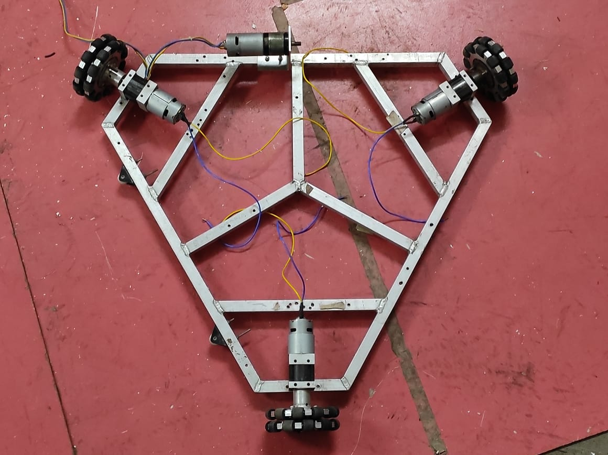
    

      <h4>3 &amp; 4-Wheel Holonomic Drives</h4>
      
Omni-WheelIndoor

      
Omni-wheel bases that can move in any direction. I did the kinematic modelling, PID-based odometry and path correction.

    

  

  

    
    

      <h4>F1TENTH Race Car</h4>
      
AckermannIndoor

      
A 1/10-scale autonomous race car that follows an optimized raceline. <a href="Projects/F1Tenth.html">Read more</a>

    

  

## Robotic Arms
{: .mt-8 }

  

    <iframe src="https://www.youtube.com/embed/C349iywNu6s" title="Logistic coBot (LB) eYRC 2024-25 Theme Film" loading="lazy" allow="accelerometer; autoplay; clipboard-write; encrypted-media; gyroscope; picture-in-picture; web-share" referrerpolicy="strict-origin-when-cross-origin" allowfullscreen></iframe>
  

  

    

      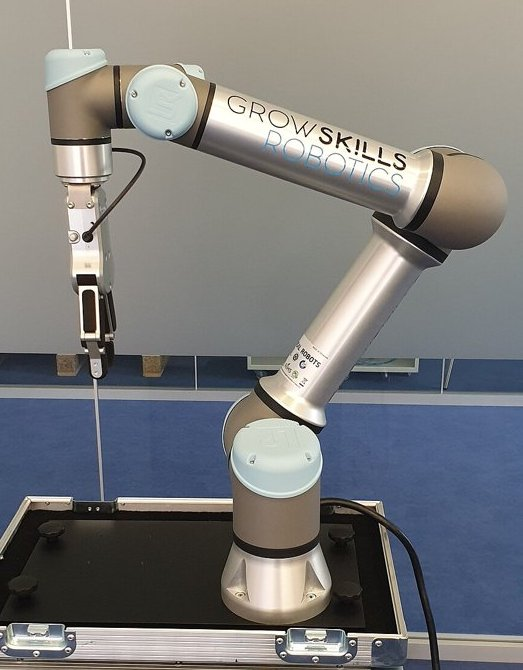
      

        Universal Robots · 6-DoF
        <h3>UR5</h3>
      

    

    
The UR5 is the collaborative arm at the centre of the e-Yantra Robotics Competition themes I developed, Cosmo Logistic and Logistic coBot. In these themes, students program it through ROS 2 to pick and place payloads, working together with the eBot mobile robot in a warehouse setting. <a href="Projects/CL.html">Read more</a>

  

  
Drawing robot video coming soon

  

    

      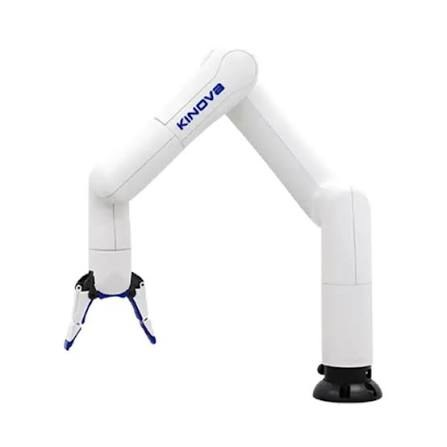
      

        Kinova · 6-DoF
        <h3>Kinova Gen3 Lite</h3>
      

    

    
A drawing robot: the arm holds a pen and sketches images on paper.

  

  
Chess robot video coming soon

  

    

      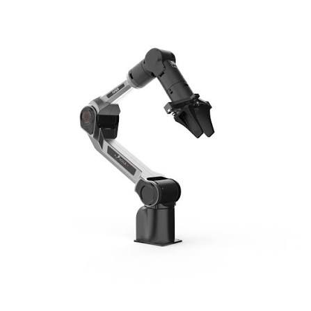
      

        AgileX · 6-DoF
        <h3>AgileX PiPER</h3>
      

    

    
A chess-playing robot that moves pieces on a physical board to play a game against a human.

  

## ABU Robocon
{: .mt-8 }

The robots I built with Team Rudra for ABU Robocon, the Asia-Pacific robotics contest where each year's game sets a new challenge.
{: .fw-300 }

### 2023: Supervising the team
{: .mt-6 }

I supervised the electronics and programming of both robots. Each was semi-automatic, a fully closed-loop system with a Teensy 4.1 as the main controller. Their task was to pick up rings and throw them onto targets to score as many points as possible.

  

    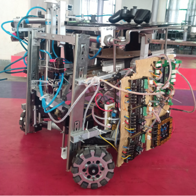
    

      <h4>Rabbit Robot</h4>
      
Picks up the placed rings and throws them onto the targets.

    

  

  

    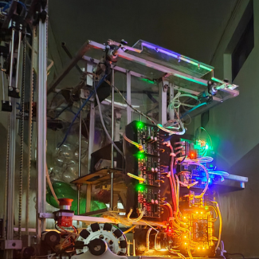
    

      <h4>Elephant Robot</h4>
      
Picks up the placed rings and throws them onto the targets.

    

  

  <iframe src="https://www.youtube.com/embed/lhZCzc_C7HQ" title="Team Rudra Journey Robocon 2023" loading="lazy" allow="accelerometer; autoplay; clipboard-write; encrypted-media; gyroscope; picture-in-picture; web-share" referrerpolicy="strict-origin-when-cross-origin" allowfullscreen></iframe>

### 2022: Electronics, programming and operating
{: .mt-6 }

I was responsible for the electronics and programming of both robots. Each was semi-automatic with a fully automatic mode, and each was a closed-loop system with active feedback on every mechanism, built around an ARM Cortex-M7 Teensy 4.1. I also operated Robot 1 at the official competition.

  

    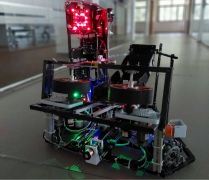
    

      <h4>Robot 1</h4>
      
Throws balls to knock down the lagori (the stack of stones) and to hit the ball on the opposing robot's head.

    

  

  

    
    

      <h4>Robot 2</h4>
      
Rebuilds the knocked-down lagori pile while balancing a ball on its head.

    

  

  <iframe src="https://www.youtube.com/embed/hE4lK5lMFOk" title="Team Rudra Journey Robocon 2022" loading="lazy" allow="accelerometer; autoplay; clipboard-write; encrypted-media; gyroscope; picture-in-picture; web-share" referrerpolicy="strict-origin-when-cross-origin" allowfullscreen></iframe>

### 2021: My first robots
{: .mt-6 }

Both robots were semi-automatic with a fully automatic mode, and each was a closed-loop system with an ATmega2560 as the main controller. I was responsible for their programming and automation.

  

    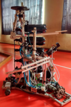
    

      <h4>Defense Robot</h4>
      
Picks up, passes, deflects and throws arrows.

    

  

  

    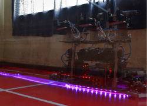
    

      <h4>Throwing Robot</h4>
      
Picks up arrows and throws them.

    

  

  <iframe src="https://www.youtube.com/embed/G_NCaxcpWDg" title="Team Rudra Journey 2021" loading="lazy" allow="accelerometer; autoplay; clipboard-write; encrypted-media; gyroscope; picture-in-picture; web-share" referrerpolicy="strict-origin-when-cross-origin" allowfullscreen></iframe>

Image credits: UR5, “Cobot.jpg” by GrowSkills Robotics, <a href="https://creativecommons.org/licenses/by-sa/4.0/">CC BY-SA 4.0</a>, cropped, via <a href="https://commons.wikimedia.org/wiki/File:Cobot.jpg">Wikimedia Commons</a>. Unitree Go2, “Unitree Go2 of Salvamont front view” by HotNews Romania (Adi Iacob, Ovidiu Popica), <a href="https://creativecommons.org/licenses/by/3.0/">CC BY 3.0</a>, via <a href="https://commons.wikimedia.org/wiki/File:Unitree_Go2_of_Salvamont_front_view.jpg">Wikimedia Commons</a>.

